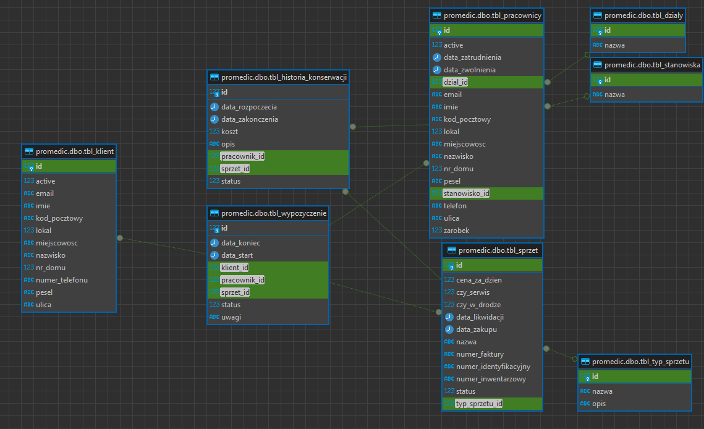

# Projekt ProMedic Lease

## Dokumentacja Techniczna i Programu

### Autorzy:
- Kamil Pietrzak

### Data Opracowania:
Maj 2024

---

### Opis Dokumentacji
Ten dokument zawiera szczegółowy opis techniczny i programowy projektu ProMedic Lease. Dokument jest przeznaczony dla wewnętrznych oraz zewnętrznych interesariuszy projektu.

---

## Wstęp
Projekt ProMedic_Lease jest zaawansowaną aplikacją do zarządzania wypożyczaniem sprzętu medycznego. Głównym celem projektu jest ułatwienie i automatyzacja procesów związanych z zarządzaniem sprzętem, klientami oraz pracownikami w firmach zajmujących się wynajmem sprzętu medycznego. Aplikacja umożliwia użytkownikom efektywne zarządzanie operacjami wypożyczania sprzętu, historią konserwacji oraz danymi klientów i pracowników, zapewniając jednocześnie integralność danych i poprawność wykonywanych operacji.

Aplikacja została zaprojektowana w sposób modularny, co umożliwia łatwe rozszerzanie funkcjonalności oraz adaptację do specyficznych wymagań użytkowników. W projekcie wykorzystano technologie ADO.NET do zarządzania bazą danych, co zapewnia wysoką wydajność oraz niezawodność operacji bazodanowych. Dodatkowo, w projekcie zastosowano wzorce projektowe, takie jak Singleton, Fasada, Repository oraz Identity Map, co pozwala na utrzymanie czytelności kodu oraz łatwość w jego utrzymaniu.

ProMedic_Lease został stworzony z myślą o użytkownikach końcowych, takich jak pracownicy firm wynajmujących sprzęt medyczny, którzy potrzebują narzędzia do skutecznego zarządzania swoją działalnością. Aplikacja oferuje intuicyjny interfejs użytkownika, który umożliwia łatwe nawigowanie oraz wykonywanie codziennych zadań.

W dokumentacji opisano szczegółowo strukturę aplikacji, zaimplementowane komponenty bazodanowe, reguły biznesowe oraz instrukcje obsługi. Celem dokumentacji jest zapewnienie pełnego zrozumienia działania aplikacji oraz umożliwienie jej dalszego rozwoju i modyfikacji przez przyszłych deweloperów.

---

### Główne funkcjonalności aplikacji ProMedic_Lease:
- Zarządzanie: dodawanie, aktualizowanie, usuwanie oraz wyszukiwanie
- Automatyczna generacja numeru inwentarzowego sprzętu.
- Walidacja danych wprowadzanych.
- Wyświetlanie tylko aktywnych obiektów.

ProMedic_Lease jest nowoczesnym narzędziem, które znacząco usprawnia zarządzanie procesami wynajmu sprzętu medycznego, zapewniając jednocześnie wysoki poziom integralności i bezpieczeństwa danych.

---

## Instrukcja obsługi

### 1. Logowanie do systemu
Uruchom aplikację ProMedic_Lease.

### 2. Nawigacja po aplikacji
Aplikacja ProMedic_Lease posiada główne menu boczne, które umożliwia dostęp do różnych sekcji aplikacji:
- Pracownicy
- Sprzęt
- Wypożyczenia
- Klienci
- Konserwacja
- Słowniki

Kliknięcie jednej z tych sekcji otwiera submenu, z którego można wybrać konkretne działania.

### 3. Zarządzanie pracownikiem, sprzętem, klientem, wypożyczeniem, konserwacją i słownikiem

#### 3.1. Dodawanie nowego obiektu
- Wybierz sekcję z głównego menu bocznego.
- Kliknij przycisk "Dodaj".
- Wypełnij formularz dodawania, wprowadzając wymagane dane.
- Kliknij przycisk "Zapisz", aby dodać nowego klienta.

#### 3.2. Edycja danych
- Wybierz sekcję z głównego menu bocznego.
- Wybierz obiekt z listy.
- Zaktualizuj dane w formularzu edycji.
- Kliknij przycisk "Zaktualizuj", aby zapisać zmiany.

#### 3.3. Usuwanie
- Wybierz sekcję z głównego menu bocznego.
- Wybierz obiekt z listy.
- Kliknij przycisk "Usuń".
- Potwierdź usunięcie.

#### 3.4. Wyszukiwanie
- Wprowadź szukane terminy w polu wyszukiwania znajdującym się w sekcji.
- Wyniki wyszukiwania zostaną automatycznie zaktualizowane w tabeli.

---

## Opis komponentów bazodanowych w ADO.NET

Dokumentacja techniczna projektu ProMedic_Lease zawiera szczegółowy opis architektury systemu, wykorzystywanych technologii, struktury bazy danych oraz implementacji komponentów bazodanowych. Celem dokumentacji jest zapewnienie zrozumienia działania aplikacji oraz ułatwienie jej dalszego rozwoju i utrzymania.

### Architektura systemu
Aplikacja ProMedic_Lease jest zbudowana w oparciu o architekturę trójwarstwową, która obejmuje:
- **Warstwę prezentacji (UI):** Interfejs użytkownika zbudowany przy użyciu Windows Forms, który umożliwia użytkownikom interakcję z aplikacją.
- **Warstwę logiki biznesowej (BLL):** Odpowiada za implementację reguł biznesowych i logiki aplikacji.
- **Warstwę dostępu do danych (DAL):** Odpowiada za komunikację z bazą danych, korzystając z technologii ADO.NET.

### Wykorzystane technologie
- C# i .NET: Język programowania i platforma do tworzenia aplikacji.
- Windows Forms: Biblioteka do tworzenia graficznego interfejsu użytkownika.
- ADO.NET: Technologia do komunikacji z bazą danych SQL Server.
- SQL Server: Relacyjna baza danych używana do przechowywania danych aplikacji.

### Struktura bazy danych
Baza danych ProMedic_Lease zawiera tabele odpowiadające głównym obiektom domeny, takim jak klienci, pracownicy, sprzęt, wypożyczenia i historia konserwacji. Struktura bazy danych jest zaprojektowana tak, aby zapewnić integralność danych i efektywność operacji.

#### Główne tabele:
- `tbl_klient`: Przechowuje informacje o klientach.
- `tbl_pracownicy`: Przechowuje informacje o pracownikach.
- `tbl_sprzet`: Przechowuje informacje o sprzęcie.
- `tbl_wypozyczenie`: Przechowuje informacje o wypożyczeniach sprzętu.
- `tbl_historia_konserwacji`: Przechowuje informacje o historii konserwacji sprzętu.
- `tbl_typ_sprzetu`: Przechowuje informacje o typach sprzętu.
- `tbl_dzialy`: Przechowuje informacje o działach.
- `tbl_stanowiska`: Przechowuje informacje o stanowiskach.



### Opis komponentów bazodanowych na przykładzie Client

#### 1. DatabaseManager
**Nazwa:** DatabaseManager  
**Funkcja:** Klasa odpowiedzialna za zarządzanie połączeniami z bazą danych oraz wykonywanie zapytań SQL.  
**Powiązania:**
- **Źródło danych:** Łączy się z bazą danych przy użyciu connection string przechowywanego w pliku konfiguracyjnym. Łączy się tylko gdy potrzebna jest ingerencja w baze danych. Po ingerencji połączenie jest od razu zamykane.
- **Współpraca z komponentami:** SqlConnection, SqlCommand, SqlDataAdapter.

```csharp
public class DatabaseManager
{
    private readonly string _connectionString;

    public DatabaseManager(IConfiguration configuration)
    {
        _connectionString = configuration.GetConnectionString("DefaultConnection");
    }

    public DataTable ExecuteQuery(string query, SqlParameter[] parameters = null)
    {
        using (var connection = new SqlConnection(_connectionString))
        using (var command = new SqlCommand(query, connection))
        {
            command.CommandType = CommandType.Text;
            if (parameters != null)
            {
                command.Parameters.AddRange(parameters);
            }

            var dataTable = new DataTable();
            using (var adapter = new SqlDataAdapter(command))
            {
                connection.Open();
                adapter.Fill(dataTable);
            }

            return dataTable;
        }
    }

    public int ExecuteNonQuery(string query, SqlParameter[] parameters = null)
    {
        using (var connection = new SqlConnection(_connectionString))
        using (var command = new SqlCommand(query, connection))
        {
            command.CommandType = CommandType.Text;
            if (parameters != null)
            {
                command.Parameters.AddRange(parameters);
            }

            connection.Open();
            var result = command.ExecuteNonQuery();
            return result;
        }
    }
}
```

## 2. Repository
**Nazwa:** ClientRepository  
**Funkcja:** Klasa implementująca interfejs IClientRepository, zarządza operacjami CRUD na obiektach Client.  
**Powiązania:**
- **Źródło danych:** Wykorzystuje DatabaseManager do wykonywania zapytań do bazy danych.
- **Powiązane modele:** Client.

```csharp
public class ClientRepository : IClientRepository
{
    private readonly DatabaseManager _databaseManager;
    private readonly Dictionary<string, string> _queries;

    public ClientRepository(DatabaseManager databaseManager)
    {
        _databaseManager = databaseManager;
        _queries = QueryConfig.Instance.Queries["Client"];
    }

    public void Add(Client client)
    {
        string query = _queries["Add"];
        SqlParameter[] parameters = BuildParameters(client);
        _databaseManager.ExecuteNonQuery(query, parameters);
        Cache.Clients.Add(client.Id, client);
    }

    public Client GetById(long id)
    {
        string query = _queries["GetById"];
        SqlParameter[] parameters = { new SqlParameter("@Id", id) };
        var dataTable = _databaseManager.ExecuteQuery(query, parameters);
        return dataTable.Rows.Count == 0 ? null : MapFromDataRow(dataTable.Rows[0]);
    }

    public IEnumerable<Client> GetAll()
    {
        string query = _queries["GetAll"];
        var dataTable = _databaseManager.ExecuteQuery(query);
        return dataTable.AsEnumerable().Select(row => MapFromDataRow(row)).ToList();
    }

    public void Update(Client client)
    {
        string query = _queries["Update"];
        SqlParameter[] parameters = BuildParameters(client, true);
        _databaseManager.ExecuteNonQuery(query, parameters);
        Cache.Clients.Update(client.Id, client);
    }

    public void Delete(long id)
    {
        string query = _queries["Delete"];
        SqlParameter[] parameters = { new SqlParameter("@Id", id) };
        _databaseManager.ExecuteNonQuery(query, parameters);
        Cache.Clients.Remove(id);
    }

    private SqlParameter[] BuildParameters(Client client, bool includeId = false)
    {
        var parameters = new List<SqlParameter>
        {
            new SqlParameter("@FirstName", client.FirstName),
            new SqlParameter("@LastName", client.LastName),
            new SqlParameter("@PESEL", client.Pesel),
            new SqlParameter("@Street", client.Street),
            new SqlParameter("@HouseNumber", client.HouseNumber),
            new SqlParameter("@ApartmentNumber", client.ApartmentNumber),
            new SqlParameter("@PostalCode", client.PostalCode),
            new SqlParameter("@City", client.City),
            new SqlParameter("@Email", client.Email),
            new SqlParameter("@Phone", client.Phone),
            new SqlParameter("@IsActive", client.IsActive),
        };

        if (includeId)
        {
            parameters.Add(new SqlParameter("@Id", client.Id));
        }

        return parameters.ToArray();
    }

    private Client MapFromDataRow(DataRow row)
    {
        return new Client
        {
            Id = Convert.ToInt64(row["id"]),
            FirstName = row["FirstName"] as string ?? string.Empty,
            LastName = row["LastName"] as string ?? string.Empty,
            Pesel = row["Pesel"] as string ?? string.Empty,
            Street = row["Street"] as string ?? string.Empty,
            HouseNumber = Convert.ToInt32(row["HouseNumber"]),
            ApartmentNumber = Convert.ToInt32(row["ApartmentNumber"]),
            PostalCode = row["PostalCode"] as string ?? string.Empty,
            City = row["City"] as string ?? string.Empty,
            Email = row["Email"] as string ?? string.Empty,
            Phone = row["Phone"] as string ?? string.Empty,
            IsActive = Convert.ToBoolean(row["IsActive"])
        };
    }
}
```

## 1. Service
**Nazwa:** ClientService  
**Funkcja:** Klasa implementująca interfejs IClientService, zarządza logiką biznesową związaną z operacjami na obiektach Client.  
**Powiązania:**
- **Źródło danych:** Wykorzystuje ClientRepository do wykonywania operacji na bazie danych.
- **Powiązane modele:** Client.

```csharp
public class ClientService : IClientService
{
    private readonly IClientRepository _clientRepository;

    public ClientService(IClientRepository clientRepository)
    {
        _clientRepository = clientRepository;
    }

    public void Add(Client client)
    {
        _clientRepository.Add(client);
    }

    public Client GetById(long id)
    {
        return _clientRepository.GetById(id);
    }

    public IEnumerable<Client> GetAll()
    {
        return _clientRepository.GetAll();
    }

    public void Update(Client client)
    {
        _clientRepository.Update(client);
    }

    public void Delete(long id)
    {
        _clientRepository.Delete(id);
    }

    public IEnumerable<Client> GetAllActive()
    {
        return _clientRepository.GetAll().Where(e => e.IsActive).ToList();
    }

    public IEnumerable<Client> Search(string searchTerm)
    {
        searchTerm = searchTerm?.ToLower() ?? "";
        return _clientRepository.GetAll()
            .Where(e => e.FirstName.ToLower().Contains(searchTerm) ||
                        e.LastName.ToLower().Contains(searchTerm) ||
                        e.Email.ToLower().Contains(searchTerm) ||
                        e.Phone.ToLower().Contains(searchTerm) ||
                        e.Street.ToLower().Contains(searchTerm) ||
                        e.City.ToLower().Contains(searchTerm) ||
                        e.PostalCode.ToLower().Contains(searchTerm))
            .ToList();
    }
}
```

## 3. FormAdd
**Nazwa:** FormAddClient  
**Funkcja:** Formularz służący do dodawania nowych klientów do systemu.  
**Powiązania:**
- **Źródło danych:** Interakcja z ClientService oraz IServiceFacade w celu dodania nowych danych klienta do bazy.

```csharp
public partial class FormAddClient : Form
{
    private IServiceFacade _serviceFacade;
    public FormAddClient(IServiceFacade serviceFacade)
    {
        InitializeComponent();
        _serviceFacade = serviceFacade;
    }

    private void btnSave_Click(object sender, EventArgs e)
    {
        var validationResult = ValidateData();
        if (!validationResult.IsValid)
        {
            MessageBox.Show(string.Join("\n", validationResult.Errors), "Błędy walidacji", MessageBoxButtons.OK, MessageBoxIcon.Warning);
            return;
        }

        Client @new = CreateFormData();
        try
        {
            _serviceFacade.ClientService.Add(@new);
            this.DialogResult = DialogResult.OK;
            this.Close();
        }
        catch (Exception ex)
        {
            MessageBox.Show($"Wystąpił błąd: {ex.Message}", "Błąd", MessageBoxButtons.OK, MessageBoxIcon.Error);
        }
    }

    private Client CreateFormData()
    {
        return new Client
        {
            FirstName = txtFirstName.Text,
            LastName = txtLastName.Text,
            Email = txtEmail.Text,
            Phone = txtPhone.Text,
            Pesel = txtPesel.Text,
            Street = txtStreet.Text,
            HouseNumber = Convert.ToInt32(nudHouseNumber.Value),
            ApartmentNumber = Convert.ToInt32(nudApartmentNumber.Value),
            PostalCode = txtPostalCode.Text,
            City = txtCity.Text,
            IsActive = true
        };
    }

    private ValidationResult ValidateData()
    {
        List<string> errors = new List<string>();

        if (string.IsNullOrWhiteSpace(txtFirstName.Text))
            errors.Add("Imię jest wymagane.");
        if (string.IsNullOrWhiteSpace(txtLastName.Text))
            errors.Add("Nazwisko jest wymagane.");
        if (!ValidationHelper.IsValidEmail(txtEmail.Text))
            errors.Add("Podaj prawidłowy email.");
        if (!ValidationHelper.IsValidPhoneNumber(txtPhone.Text))
            errors.Add("Numer telefonu jest nieprawidłowy. Powinien zawierać 9 cyfr.");
        if (!ValidationHelper.IsValidPesel(txtPesel.Text))
            errors.Add("PESEL jest nieprawidłowy.");
        if (!ValidationHelper.IsValidPostalCode(txtPostalCode.Text))
            errors.Add("Kod pocztowy jest nieprawidłowy. Wymagany format to 00-000.");
        if (nudHouseNumber.Value <= 0)
            errors.Add("Numer domu musi być większy niż 0.");
        if (nudApartmentNumber.Value < 0) 
            errors.Add("Numer lokalu nie może być ujemny.");

        return new ValidationResult(errors);
    }
}
``` 

## 4. Form
**Nazwa:** FormClient  
**Funkcja:** Formularz służący do zarządzania klientami, umożliwia dodawanie, edytowanie oraz usuwanie klientów.  
**Powiązania:**
- **Źródło danych:** Interakcja z ClientService oraz IServiceFacade w celu zarządzania danymi klientów.

```csharp
using ProMedic_Lease.Models;
using ProMedic_Lease.Patterns.structural;
using ProMedic_Lease.Services.Interfaces;
using ProMedic_Lease.Utilities;
using System;
using System.Collections.Generic;
using System.ComponentModel;
using System.Data;
using System.Drawing;
using System.Linq;
using System.Text;
using System.Threading.Tasks;
using System.Windows.Forms;

namespace ProMedic_Lease.View
{
    public partial class FormClient : Form
    {
        private IServiceFacade _serviceFacade;
        public FormClient(IServiceFacade serviceFacade)
        {
            _serviceFacade = serviceFacade;
            InitializeComponent();
            RefreshGrid();
        }

        private void dgvClients_SelectionChanged(object sender, EventArgs e)
        {
            if (dgvClients.SelectedRows.Count > 0)
            {
                var row = dgvClients.SelectedRows[0];
                txtFirstName.Text = Convert.ToString(row.Cells["FirstName"].Value);
                txtLastName.Text = Convert.ToString(row.Cells["LastName"].Value);
                txtEmail.Text = Convert.ToString(row.Cells["Email"].Value);
                txtPesel.Text = Convert.ToString(row.Cells["Pesel"].Value);
                txtPhone.Text = Convert.ToString(row.Cells["Phone"].Value);
                txtStreet.Text = Convert.ToString(row.Cells["Street"].Value);
                nudHouseNumber.Value = Convert.ToDecimal(row.Cells["HouseNumber"].Value);
                nudApartmentNumber.Value = Convert.ToDecimal(row.Cells["ApartmentNumber"].Value);
                txtPostalCode.Text = Convert.ToString(row.Cells["PostalCode"].Value);
                txtCity.Text = Convert.ToString(row.Cells["City"].Value);
                chkIsActive.Checked = Convert.ToBoolean(row.Cells["IsActive"].Value);

            }
        }

        private void btnAdd_Click(object sender, EventArgs e)
        {
            using (FormAddClient addForm = new FormAddClient(_serviceFacade))
            {
                DialogResult result = addForm.ShowDialog(this);

                if (result == DialogResult.OK)
                {
                    RefreshGrid();
                    MessageBox.Show("Nowy klient został dodany.", "Dodanie klienta", MessageBoxButtons.OK, MessageBoxIcon.Information);
                }
                else if (result == DialogResult.Cancel)
                {
                    MessageBox.Show("Dodawanie nowego klienta zostało anulowane.", "Anulowano", MessageBoxButtons.OK, MessageBoxIcon.Information);
                }
            }
        }

        private void btnUpdate_Click(object sender, EventArgs e)
        {
            if (dgvClients.SelectedRows.Count > 0)
            {
                var row = dgvClients.SelectedRows[0];
                long id = Convert.ToInt64(row.Cells["Id"].Value);

                Client updated = _serviceFacade.ClientService.GetById(id);
                if (updated == null)
                {
                    MessageBox.Show("Nie znaleziono pracownika.", "Błąd", MessageBoxButtons.OK, MessageBoxIcon.Error);
                    return;
                }

                PrepareForUpdate(updated);

                var validationResult = ValidateData(updated);
                if (!validationResult.IsValid)
                {
                    MessageBox.Show(string.Join("\n", validationResult.Errors), "Błędy walidacji", MessageBoxButtons.OK, MessageBoxIcon.Warning);
                    return;
                }

                try
                {
                    _serviceFacade.ClientService.Update(updated);
                    MessageBox.Show("Pomyślnie zaktualizowano dane klienta.", "Aktualizacja zakończona", MessageBoxButtons.OK, MessageBoxIcon.Information);
                    RefreshGrid();  
                }
                catch (Exception ex)
                {
                    MessageBox.Show($"Wystąpił błąd: {ex.Message}", "Błąd aktualizacji", MessageBoxButtons.OK, MessageBoxIcon.Error);
                }
            }
            else
            {
                MessageBox.Show("Nie zaznaczono żadnego klienta.", "Brak selekcji", MessageBoxButtons.OK, MessageBoxIcon.Warning);
            }
        }

        private void btnDelete_Click(object sender, EventArgs e)
        {
            if (dgvClients.SelectedRows.Count > 0)
            {
                var row = dgvClients.SelectedRows[0];
                long id = Convert.ToInt64(row.Cells["Id"].Value);

                var result = MessageBox.Show("Czy na pewno chcesz usunąć tego klienta?", "Potwierdzenie usunięcia", MessageBoxButtons.YesNo, MessageBoxIcon.Warning);

                if (result == DialogResult.Yes)
                {
                    try
                    {
                        _serviceFacade.ClientService.Delete(id);
                        MessageBox.Show("Klient został usunięty.", "Usunięcie zakończone sukcesem", MessageBoxButtons.OK, MessageBoxIcon.Information);
                        RefreshGrid();
                    }
                    catch (Exception ex)
                    {
                        MessageBox.Show($"Wystąpił błąd podczas usuwania klienta: {ex.Message}", "Błąd", MessageBoxButtons.OK, MessageBoxIcon.Error);
                    }
                }
            }
            else
            {
                MessageBox.Show("Nie wybrano żadnego klienta.", "Brak zaznaczenia", MessageBoxButtons.OK, MessageBoxIcon.Exclamation);
            }
        }

        private void btnSearch_Click(object sender, EventArgs e)
        {
            string searchTerm = txtSearch.Text;
            var filteredResults = _serviceFacade.ClientService.Search(searchTerm);
            UpdateGrid(filteredResults);
        }
        private void RefreshGrid()
        {
            var clients = _serviceFacade.ClientService.GetAll();
            UpdateGrid(clients);
        }

        private void UpdateGrid(IEnumerable<Client> clients)
        {
            dgvClients.DataSource = clients;
        }

        private void PrepareForUpdate(Client client)
        {
            client.FirstName = txtFirstName.Text;
            client.LastName = txtLastName.Text;
            client.Email = txtEmail.Text;
            client.Phone = txtPhone.Text;
            client.Pesel = txtPesel.Text;
            client.Street = txtStreet.Text;
            client.HouseNumber = Convert.ToInt32(nudHouseNumber.Value);
            client.ApartmentNumber = Convert.ToInt32(nudApartmentNumber.Value);
            client.PostalCode = txtPostalCode.Text;
            client.City = txtCity.Text;
            client.IsActive = chkIsActive.Checked;
        }

        private ValidationResult ValidateData(Client client)
        {
            List<string> errors = new List<string>();

            if (string.IsNullOrWhiteSpace(client.FirstName))
                errors.Add("Imię jest wymagane.");
            if (string.IsNullOrWhiteSpace(client.LastName))
                errors.Add("Nazwisko jest wymagane.");
            if (!ValidationHelper.IsValidEmail(client.Email))
                errors.Add("Podaj prawidłowy email.");
            if (!ValidationHelper.IsValidPhoneNumber(client.Phone))
                errors.Add("Numer telefonu jest nieprawidłowy. Powinien zawierać 9 cyfr.");
            if (!ValidationHelper.IsValidPesel(client.Pesel))
                errors.Add("PESEL jest nieprawidłowy.");
            if (!ValidationHelper.IsValidPostalCode(client.PostalCode))
                errors.Add("Kod pocztowy jest nieprawidłowy. Wymagany format to 00-000.");
            if (client.HouseNumber <= 0)
                errors.Add("Numer domu musi być większy niż 0.");
            if (client.ApartmentNumber < 0)
                errors.Add("Numer lokalu nie może być ujemny.");

            return new ValidationResult(errors);
        }
    }
}
```

## 5. QueryConfig
**Nazwa:** QueryConfig  
**Funkcja:** Singleton zarządzający konfiguracją zapytań SQL, wczytuje zapytania z pliku JSON.  
**Powiązania:**
- **Źródło danych:** Ładuje zapytania z pliku queries.json.
- **Powiązania z Repository:** Pobieranie odpowiednich zapytań SQL.

```csharp
public class QueryConfig
{
    private static QueryConfig _instance;
    private static readonly object _lock = new object();
    public Dictionary<string, Dictionary<string, string>> Queries { get; private set; }

    private QueryConfig()
    {
        var baseDirectory = AppDomain.CurrentDomain.BaseDirectory;
        var projectDirectory = Directory.GetParent(baseDirectory).Parent.Parent.Parent.FullName;
        var queryFilePath = Path.Combine(projectDirectory, "Resources", "queries.json");

        var jsonData = File.ReadAllText(queryFilePath);
        Queries = JsonConvert.DeserializeObject<Dictionary<string, Dictionary<string, string>>>(jsonData);
    }

    public static QueryConfig Instance
    {
        get
        {
            lock (_lock)
            {
                if (_instance == null)
                {
                    _instance = new QueryConfig();
                }
                return _instance;
            }
        }
    }
}
```

## Opis zaimplementowanych reguł biznesowych
W projekcie ProMedic_Lease zaimplementowano szereg reguł biznesowych, które mają na celu zapewnienie integralności danych oraz poprawność operacji wykonywanych przez użytkowników. Poniżej znajdują się opisy najważniejszych reguł biznesowych zaimplementowanych w projekcie.

### 1. Walidacja danych 
Podczas dodawania lub aktualizacji danych, system weryfikuje poprawność wprowadzonych informacji. Oto szczegółowe reguły walidacji:

**Nazwy:**
- Pola opisujące obiekt są wymagane i nie mogą być puste.

**Adres email:**
- Pole Email musi zawierać prawidłowy adres email.

**Numer telefonu:**
- Pole Phone musi zawierać 9 cyfr.

**PESEL:**
- Pole Pesel musi zawierać 11 cyfr i być zgodne z polskimi standardami numeru PESEL.

**Kod pocztowy:**
- Pole PostalCode musi być zgodne z formatem polskiego kodu pocztowego (00-000).

**Numer domu i lokalu:**
- Pole HouseNumber musi być większe niż 0.
- Pole ApartmentNumber nie może być ujemne.

**Data:**
- Data rozpoczęcia nie może być późniejsza niż data zakończenia.

**Koszty i ceny:**
- Muszą być większe niż 0.

```csharp
public class ValidationHelper
{
    public static bool IsValidEmail(string email)
    {
        try
        {
            var addr = new System.Net.Mail.MailAddress(email);
            return addr.Address == email;
        }
        catch
        {
            return false;
        }
    }

    public static bool IsValidPesel(string pesel)
    {
        if (pesel.Length != 11 || !pesel.All(char.IsDigit))
        {
            return false;
        }

        int[] weights = { 1, 3, 7, 9, 1, 3, 7, 9, 1, 3 };
        int sum = 0;
        for (int i = 0; i < 10; i++)
        {
            sum += weights[i] * int.Parse(pesel[i].ToString());
        }
        int lastDigit = int.Parse(pesel[10].ToString());
        sum %= 10;
        sum = 10 - sum;
        sum %= 10;

        return lastDigit == sum;
    }

    public static bool AreDatesValid(DateTime startDate, DateTime? endDate)
    {
        if (endDate.HasValue)
        {
            return startDate <= endDate.Value;
        }
        return true;
    }

    public static bool IsValidPhoneNumber(string phoneNumber)
    {
        return !string.IsNullOrWhiteSpace(phoneNumber) && phoneNumber.All(char.IsDigit) && phoneNumber.Length == 9;
    }

    public static bool IsValidPostalCode(string postalCode)
    {
        if (string.IsNullOrWhiteSpace(postalCode))
        {
            return false;
        }

        Regex regex = new Regex(@"^\d{2}-\d{3}$");
        return regex.IsMatch(postalCode);
    }

    public static bool IsStringNotNullOrEmpty(string str)
    {
        return !string.IsNullOrEmpty(str);
    }
}
```

```csharp
public class ValidationResult
{
    public bool IsValid => Errors.Count == 0;
    public List<string> Errors { get; }

    public ValidationResult(List<string> errors)
    {
        Errors = errors;
    }
}
```
```csharp
private ValidationResult ValidateData(Employee employee)
{
    List<string> errors = new List<string>();

    if (string.IsNullOrWhiteSpace(employee.FirstName))
        errors.Add("Imię jest wymagane.");
    if (string.IsNullOrWhiteSpace(employee.LastName))
        errors.Add("Nazwisko jest wymagane.");
    if (!ValidationHelper.IsValidEmail(employee.Email))
        errors.Add("Podaj prawidłowy email.");
    if (!ValidationHelper.IsValidPhoneNumber(employee.Phone))
        errors.Add("Numer telefonu jest nieprawidłowy. Powinien zawierać 9 cyfr.");
    if (!ValidationHelper.IsValidPesel(employee.Pesel))
        errors.Add("PESEL jest nieprawidłowy.");
    if (!ValidationHelper.IsValidPostalCode(employee.PostalCode))
        errors.Add("Kod pocztowy jest nieprawidłowy. Wymagany format to 00-000.");
    if (employee.Salary <= 0)
        errors.Add("Wynagrodzenie musi być większe niż 0.");
    if (employee.HouseNumber <= 0)
        errors.Add("Numer domu musi być większy niż 0.");
    if (employee.ApartmentNumber < 0)
        errors.Add("Numer lokalu nie może być ujemny.");

    return new ValidationResult(errors);
}
```

### 2. Sprawdzanie dostępności sprzętu
Podczas pobierania obiektów, system sprawdza dostępność wybranych zasobów. Jeśli zasób jest oznaczony w bazie jako niedostępny, nie można go wybrać. Na przykład, sprzęt, który jest już wypożyczony, lub pracownik, który zakończył współpracę, nie będzie dostępny do wyboru. System zapewnia, że użytkownik widzi tylko dostępne zasoby, co zapobiega błędom w zarządzaniu zasobami.

Przykład:
```csharp
public IEnumerable<Equipment> GetAllActive()
{
    return _equipmentRepository.GetAll().Where(e => e.IsActive == true && e.IsServiced == false).ToList();
}
```

### 3. Zarządzanie automatyczne statusem i datą
System automatycznie rejestruje daty rozpoczęcia i zakończenia oraz statusy zasobów. Jeśli klient zwróci sprzęt i pracownik wprowadzi datę zakończenia wypożyczenia, system automatycznie zmienia status sprzętu na dostępny. Podobnie, jeśli sprzęt zostanie zamieniony lub oddany do likwidacji poprzez wprowadzenie daty likwidacji, jego status również zostanie zaktualizowany. W przypadku pracowników, podanie daty zakończenia współpracy skutkuje automatycznym oznaczeniem ich jako niedostępnych.

### 4. Zapewnienie spójności danych poprzez pamięć podręczną (Cache)
System wykorzystuje mechanizm pamięci podręcznej (Cache), aby zapewnić spójność danych i zwiększyć wydajność operacji odczytu.

```csharp
    public static class Cache
    {
        public static IdentityMap<Department> Departments = new IdentityMap<Department>();
        public static IdentityMap<Position> Positions = new IdentityMap<Position>();
        public static IdentityMap<EquipmentType> EquipmentTypes = new IdentityMap<EquipmentType>();
        public static IdentityMap<Client> Clients = new IdentityMap<Client>();
        public static IdentityMap<Equipment> Equipments = new IdentityMap<Equipment>();
        public static IdentityMap<Employee> Employees = new IdentityMap<Employee>();
        public static IdentityMap<Rental> Rentals = new IdentityMap<Rental>();
        public static IdentityMap<MaintenanceHistory> MaintenanceHistory = new IdentityMap<MaintenanceHistory>();
    }
```

```csharp
public class IdentityMap<T>
{
    private Dictionary<long, T> map = new Dictionary<long, T>();

    public T GetOrCreate(long id, Func<T> createItem)
    {
        if (map.ContainsKey(id))
        {
            return map[id];
        }
        else
        {
            var newItem = createItem();
            map.Add(id, newItem);
            return newItem;
        }
    }

    public void Clear()
    {
        map.Clear();
    }

    public bool Remove(long id)
    {
        return map.Remove(id);
    }

    public bool Update(long id, T newItem)
    {
        if (map.ContainsKey(id))
        {
            map[id] = newItem;
            return true;
        }
        return false;
    }

    public void Add(long id, T item)
    {
        map.Add(id, item);
    }

    public T Get(long id)
    {
        if (map.ContainsKey(id))
        {
            return map[id];
        }
        return default(T);
    }

    public bool ContainsKey(long id)
    {
        return map.ContainsKey(id);
    }
}
```

### 5. Automatyczna generacja numeru inwentarzowego sprzętu
Podczas dodawania nowego sprzętu, system automatycznie generuje numer inwentarzowy na podstawie numeru id, typu sprzętu i roku zakupu.

```csharp
private Equipment CreateFromFormData()
{
    return new Equipment
    {
        Name = txtName.Text,
        EquipmentType = cmbEquipmentType.SelectedItem as EquipmentType,
        InventoryNumber = $"{numInventoryNumber.Value}/{cmbEquipmentType.SelectedItem.ToString()}/{DateTime.Now.Year}",
        PurchaseDate = dtpPurchaseDate.Value,
        InvoiceNumber = txtInvoiceNumber.Text,
        IdentificationNumber = txtIdentificationNumber.Text,
        IsServiced = false,
        IsInTransit = chkIsInTransit.Checked,
        IsActive = true,
        DailyRentalPrice = nudDailyRentalPrice.Value
    };
}
```
