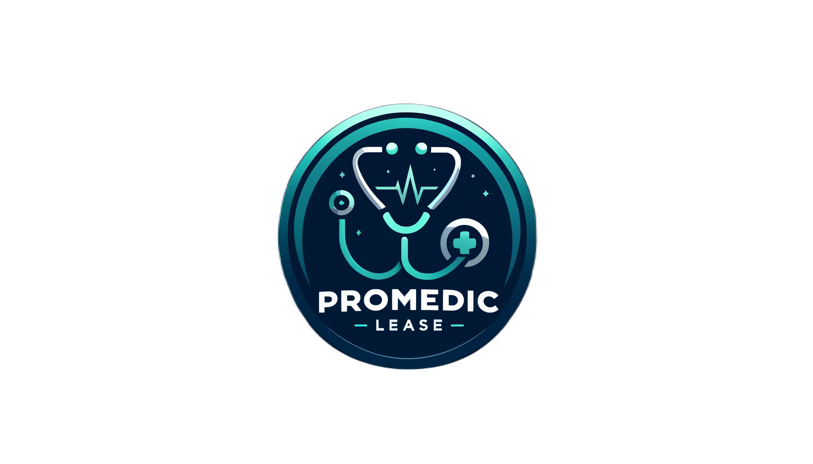

# ProMedic Lease - System Zarządzania Wynajmem Sprzętu Medycznego

## Opis

ProMedic Lease to system zarządzania wynajmem sprzętu medycznego, stworzony z myślą o placówkach medycznych oraz firmach wynajmujących. System zapewnia efektywne zarządzanie zasobami, umożliwiając lepsze planowanie, monitorowanie i optymalizację wykorzystania sprzętu medycznego.



## Architektura

System ProMedic Lease składa się z kilku kluczowych komponentów, które współpracują, aby zapewnić pełną funkcjonalność potrzebną do zarządzania wynajmem:

### Modele

Modele w ProMedic Lease reprezentują struktury danych używane w całym systemie. Każdy z nich posiada odpowiedni serwis i repozytorium.

- **Client**: Zarządzanie informacjami o klientach.
- **Equipment**: Przechowywanie danych o sprzęcie medycznym.
- **Rental**: Śledzenie szczegółów wynajmu sprzętu.

### Serwisy

Serwisy implementują logikę biznesową aplikacji i odpowiadają za interakcje między repozytoriami a widokami.

- **ClientService**: Obsługa operacji na danych klientów.
- **EquipmentService**: Zarządzanie informacjami o sprzęcie.
- **RentalService**: Przetwarzanie operacji wynajmu.

### Repozytoria

Repozytoria oferują metodę dostępu do danych, abstrahując logikę dostępu do bazy danych.

- **ClientRepository**: Komunikacja z bazą danych dla klientów.
- **EquipmentRepository**: Dostęp do danych sprzętu.
- **RentalRepository**: Zarządzanie wynajmem w bazie danych.

### Widoki

Interfejs użytkownika, który umożliwia użytkownikom interakcję z systemem.

- **FormClient**: Formularz do zarządzania klientami.
- **FormEquipment**: Interfejs zarządzania sprzętem.
- **FormRental**: Panel do obsługi wynajmu.

## Instalacja

Aby uruchomić ProMedic Lease, wykonaj poniższe kroki:

1. **Sklonuj repozytorium projektu:**
   Użyj poniższego polecenia w terminalu, aby sklonować repozytorium:
   ```bash
   git clone https://github.com/KadilPiterson/ProMedic-Lease

2. **Skonfiguruj bazę danych SQL Server.**

2.0 **Możesz pobrac gotowy serwer bazodanowym wraz z bazą danych poprzez Docker lub wygrać plik SQL z bazą danych na własny serwer**
Plik SQL znajduję się w katalogu: ./Resources/promedic.sq [`promedic.sql`](./Resources/promedic.sql)

2.1. **Pobranie i instalacja Dockera****

Przejdź na stronę internetową Docker Desktop [link](https://www.docker.com/products/docker-desktop/) i pobierz Docker Desktop dla swojego systemu operacyjnego. Zainstaluj go, korzystając z dostępnych instrukcji.

2.2. **Pobranie obrazu SQL Server z Docker Hub. Uruchom terminal i wykonaj następujące polecenie, aby pobrać obraz bazy danych SQL Server**
```bash
   docker pull kadilpiterson/promedic-lease-db:latest
```

2.3 **Uruchomienie kontenera SQL Server:**
```bash
    docker run -e "ACCEPT_EULA=Y" -e "SA_PASSWORD=H@rdP@ssw0rd!" -p 1433:1433 --name sqlserver -d kadilpiterson/promedic-lease-db:latest
```

3. **Ustaw parametry połączenia w pliku [`appsettings.json`](./appsettings.json):**
   Edytuj plik `appsettings.json` i wprowadź odpowiednie parametry połączenia jeśli zmieniłeś dane w docker run:
```json
   {
     "ConnectionStrings": {
       "DefaultConnection": "Server=twoj_server;Database=twoja_baza_danych;User Id=twoj_uzytkownik;Password=twoje_haslo;"
     }
   }
```

4. **Zainstaluj potrzebne zależności:**
   Otwórz terminal i wykonaj poniższe polecenia, aby zainstalować niezbędne pakiety:
```bash
   dotnet add package Krypton.Toolkit
   dotnet add package Microsoft.Data.SqlClient
   dotnet add package Microsoft.Extensions.Configuration.FileExtensions
   dotnet add package Microsoft.Extensions.Configuration.Json
   dotnet add package Microsoft.Extensions.DependencyInjection
   dotnet add package Newtonsoft.Json
   dotnet add package System.Data.SqlClient
```

## Użycie
System jest zaprojektowany z myślą o intuicyjnej obsłudze. Pracownik ma dostęp do różnych modułów.

**Zarządzanie** 
Dodawaj, aktualizuj, usuwaj, wyszukuj informacje o za pomocą paneli.

## Wsparcie
W razie problemów technicznych lub pytań dotyczących działania systemu, prosimy o kontakt przez zakładkę Issues w repozytorium GitHub.

## Dokumentacja
Dokumentacja techniczna i opisowa programu znajduję się tutaj: [`DOCUMENTATION`](./Documentation.md)

## Licencja
ProMedic Lease jest udostępniany na licencji, która pozwala na bezpłatne użytkowanie i testowanie w celach niekomercyjnych. Użycie oprogramowania do celów komercyjnych bez wyraźnej zgody autora jest zabronione. Dzięki temu podejściu, użytkownicy mogą dokładnie ocenić funkcjonalność systemu przed podjęciem decyzji o komercyjnym zastosowaniu lub nawiązaniu współpracy z deweloperem.
Wszystkie pytania dotyczące licencji komercyjnych lub niestandardowych zastosowań ProMedic Lease powinny być kierowane do [pietrzak.kamil@proton.me](mailto:pietrzak.kamil@proton.me).
Pełny tekst licencji znajduje się w dołączonym pliku [`LICENSE`](./LICENSE.md) w głównym katalogu projektu.
